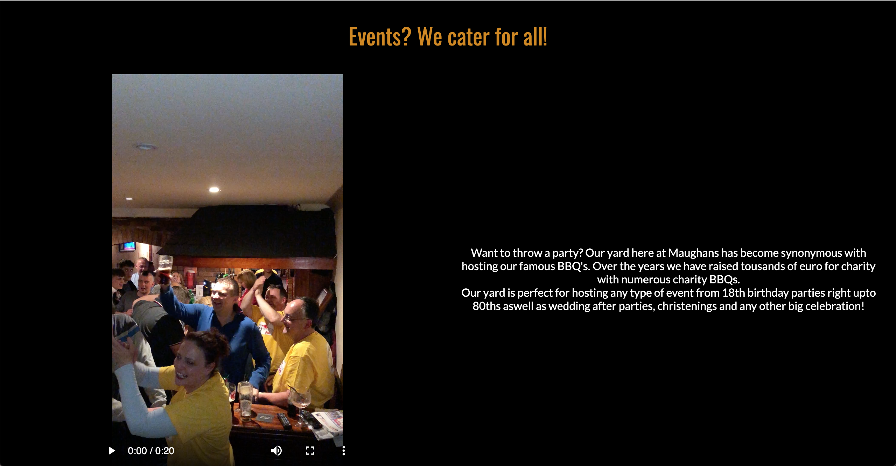
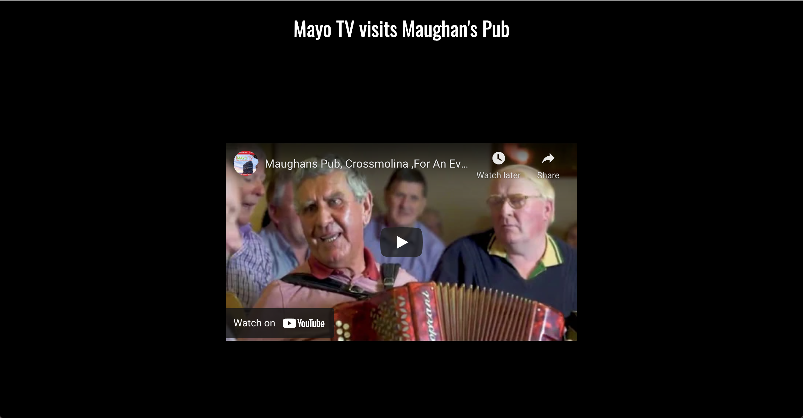
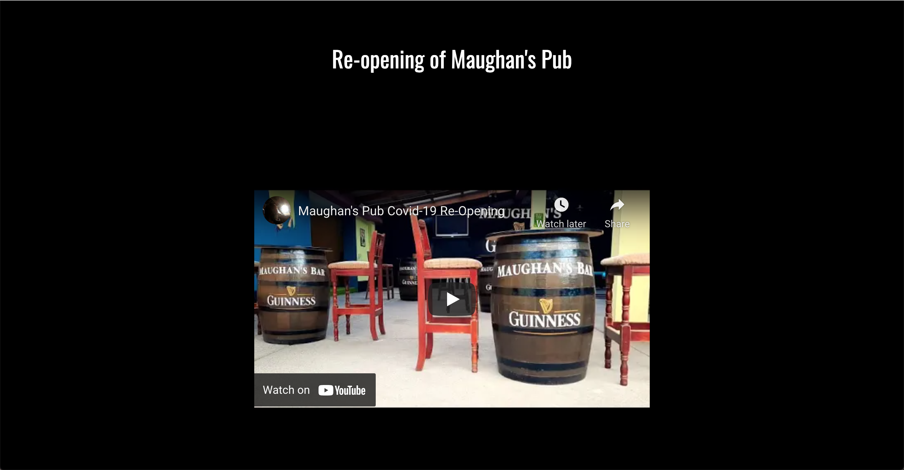
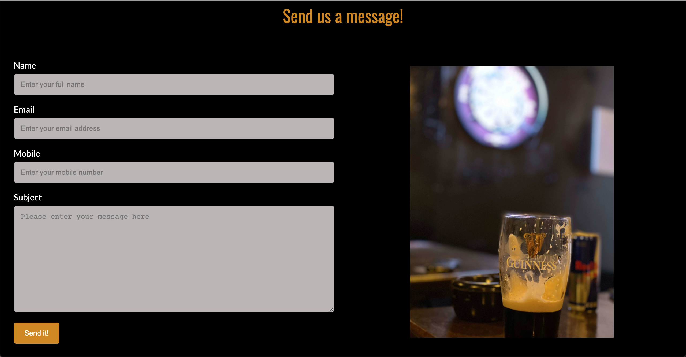
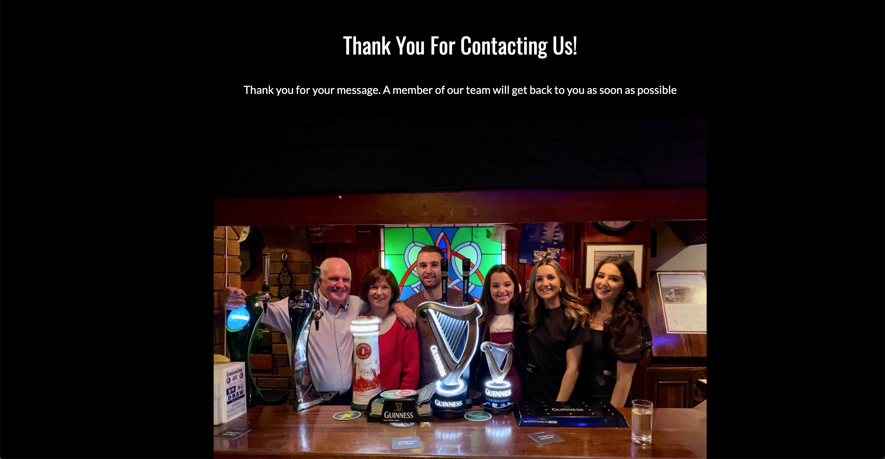
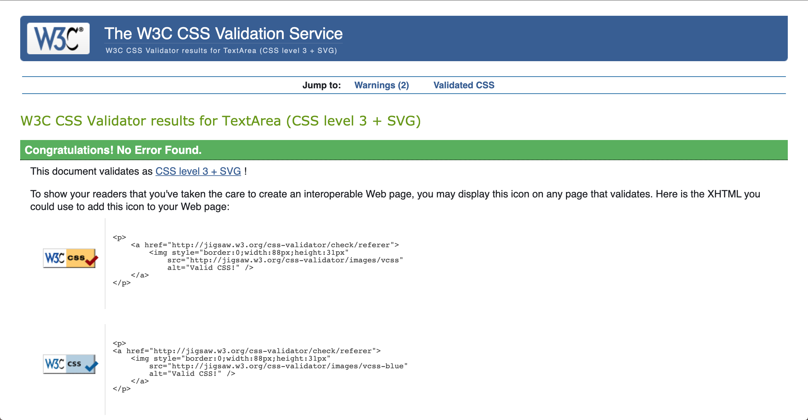

# Maughans Pub 
## Introduction
Maughans Pub is a website about Maughans Pub, a traditional Irish Pub in Crossmolina, Co. Mayo in the west of Ireland. The website is targeted towards both potential customers and current customers of the pub. As there is no current website, it will be a useful asset for customers with common questions such as hosting events, opening hours and the location of the pub.

The live link can be found here - [Maughans Pub Live Site](https://shanecooney111.github.io/maughans_pub/)

### User Stories
* As a user I want to find the opening hours for Maughans Pub. 
* As a user I want to easily find information about what facilities Maughans Pub has.
* As a user I want to easily find out about the location of Maughans Pub. 
* As a user I want to know if Maughans Pub is suitable for events.
* As a user I want to easily contact someone about hosting an event at the pub. 
* As the business we want to promote the pub and its facilities.
* As the business we want to visually show our venue including our new yard. 
* As the business we want to drive traffic to our social media channels where we can promote upcoming events such as live music. 
* As the business we want a host a facility where potential and current customers can ask questions. 
* As the business we want to handle drink orders from the yard online.

### Opportunities
Arising from user stories 
|Opportunities | Importance | Viability / Feasibility
|-----|:------:|:-----:|
|**Promote the pub and its facilities** | 5 | 5 |
|**Provide useful information such as location and opening hours** | 5 | 5 |
|**Provide information on events at Maughans Pub** | 5 | 5 |
|**Provide links to social media channels to drive traffic** | 5 | 5 |
|**Provide contact form for further queries** | 5 | 5 |
|**Responsive site suitable for mobile and tablets**| 5 | 5 |
|~~Enable users to order drinks from the yard online~~ | 3 | 1 |

## Wireframe mockups
I utilised Balsamiq to produce wireframes to organise the site structure and content placement. I used the templates provided for iPad and iPhone to create a visually pleasing mobile responsive design.

* [Home page wireframe](https://github.com/shanecooney111/maughans_pub/blob/master/assets/wireframes/index.png)
* [Yard page wireframe](https://github.com/shanecooney111/maughans_pub/blob/master/assets/wireframes/Yard.png)
* [Media page wireframe](https://github.com/shanecooney111/maughans_pub/blob/master/assets/wireframes/Media.png)
* [Contact page wireframe](https://github.com/shanecooney111/maughans_pub/blob/master/assets/wireframes/Contact%20Page.png)

## Features
 
### Common Features 
* Navigation Bar
  * The navigation bar features a common design across all 5 of the .html pages and features a text logo Maughan's Bar in the centre with 4 links to the left.  
  * The navigation bar includes links on the logo, Pub, Yard, Media and Contact. The various title links head to their respective pages for easy navigation. When the text logo is clicked it links back to the index.html page. 
  * The navigation bar is fully responsive and with the use of a media query, the format changes to a burger menu on the left-hand side which the user can toggle on devices smaller than 1025px to display the 4 navigation links. 
  * The current page is displayed in a different colour as the other links as a visual indicator to the user as to which page they are currently on. A line appearing underneath the text on hover to visually indicate to users that they are clickable.

* Information Grids

  * On both the Pub and Yard pages there are 5 common information grids that all use a common layout.
  * They are build using CSS Grid in a mobile-first design and use a Media Query to transform the layout for screens larger than 1024px. 
  * Each of the 5 sections contain a Heading, Text providing various pieces of information on the business and an image. 
  * The background colours and font colours were chosen to match the colours that the outside of the Pub are styled in and to provide maximum contrast to the user.

  

* Footer 

  * The Footer is common to all 5 HTML pages built into the Maughans Pub website.
  * The Footer was made using CSS Grid in a mobile-first design. It uses two media queries to expand for both tablet and laptop devices to make it look more esthetically pleasing.
  * The Footer contains 5 different sections with each providing useful information to the user. They are Contact Details, Map, Opening Hours, Social Media Links and finally the Web Designer.
  * The background colour was chosen to provide contrast to visually impaired users and to clearly define the Footer area from different sections on the pages.

  

### Home Page Features

* Hero image

  * The Pub page displays a hero image giving a clear visual indication of the business from the outside.
  * This image acts as a second Logo providing the additional information from the sign such as Est. 1911.

### Yard Page Features

* Hero Image
  
  * The Yard page displays a hero image giving the user a clear overview of the yard.
  * The image was taken in Pano mode in an attempt to fit in as much of the yard as possible.

* Gallery Section
  
  * I created a Gallery section on the Yard page to display multiple photos.
  * The Gallery section is fully responsive using CSS Grid and Media Queries to change format depending on what device the user is using.
  * As the Yard area of the business is new, I wanted to display as much of this new area to the user as possible. 
  * On a tablet device, one extra image displays to ensure the grid looked symmetrical in a 3X3 format. This image doesn't appear on a mobile or desktop device.

* Events Section
  
  * The events section has a small change from the other information grid where this section uses a video instead of an image. 
  * The video is a short 20 seconds and gives the user controls.

### Media Page Features

* Hero Video

  * I have used an embedded Youtube video as my hero video for media.html. As the file size was very large it was logical to embed it from Youtube. 
  * It features a segment from a TV show that was shot in the Pub by IMayo TV.

* Instagram Feed

  * The Instagram Feed section features the 8 most recent Instagram posts from the Maughan's Pub Instagram account.
  * There is a large call to action at the top with the Pub Instagram account linked to the Instagram Logo at the top of the section. 

* Covid Video

  * Maughan's Pub recently recorded a re-opening information video for operating post-Covid 19. This video was uploaded to Youtube as unlisted and embedded on the media.html page here. 

### Contact Page Features

* Contact Form

  * The contact form provides users with the ability to contact Maughan's Pub directly with any questions or comments.
  * The user is asked for their name, email, mobile and a message or query they have. 

### Hidden Page Features

* Contact Form Submission

  * A response to the contact form submission is displayed to those users who successfully fill out the form.
  * This is displayed through a thank you message and a photo of the staff.

## Future Enhancements

* The ability for customers to scan a QR code on their table and order a drink online would be hugely beneficial for both staff and customers as due to Covid 19, the Pub must operate under table service only. This would allow the bar staff to start drink orders before the waiting staff come into the Pub to pick up the drinks.

## Testing
* I undertook a 2 step approach to testing. Firstly my mentor advised me to deploy asap and test as I go. This continuous testing proved to be very helpful as when I would make a change I would test it using Google Dev Tools, to ensure the application that was intended was correct.

* For the second step of testing, I undertook a structured approach and tested every feature on every page on 3 personal devices I owned. These were undertaken on an iPhone 11 Pro, an Ipad Air and a Macbook Pro 13". This again proved very helpful and encouraged me to alter the layout of the CSS grids on tablet devices to be more aligned with the mobile device style. 

* Lastly I asked multiple friends to test the website on their devices and asked them to make a note of anything they found unusual or that they thought was wrong. This proved particularly helpful for typos.

* Interesting Bugs

## Validator Testing 

* HTML 
  * No errors were returned when passing through the official W3C Validator.
    * [Home page](https://validator.w3.org/nu/?showsource=yes&showoutline=yes&doc=https%3A%2F%2Fshanecooney111.github.io%2Fmaughans_pub%2Findex.html)
    * [Yard page](https://validator.w3.org/nu/?showsource=yes&showoutline=yes&doc=https%3A%2F%2Fshanecooney111.github.io%2Fmaughans_pub%2Fyard.html)
    * [Media page](https://validator.w3.org/nu/?showsource=yes&showoutline=yes&doc=https%3A%2F%2Fshanecooney111.github.io%2Fmaughans_pub%2Fmedia.html)
    * [Contact page](https://validator.w3.org/nu/?showsource=yes&showoutline=yes&doc=https%3A%2F%2Fshanecooney111.github.io%2Fmaughans_pub%2Fcontact.html)
    * [Form submission page](https://validator.w3.org/nu/?showsource=yes&showoutline=yes&doc=https%3A%2F%2Fshanecooney111.github.io%2Fmaughans_pub%2Fform-submit.html%3FfullName%3DShane%2BCooney%26email%3Dshanecooney111%2540gmail.com%26mobile%3D%252B353866690314%26subject%3Da)

* CSS
  * No errors were returned when passing through the official (Jigsaw) Validator
  

## Deployment

* The site was deployed to GitHub pages. the steps to deploy are as follows: 
  * In the GitHub repository, navigate to the settings tab
  * Select the pages to link from the setting menu on the left-hand side 
  * Under the GitHub Pages from the source section drop-down menu, select the master branch 
  * Once the master branch has been selected, the page will be automatically refreshed with a detailed ribbon display to indicate the successful deployment. 
  
The live link can be found here - [Maughans Pub Live Site](https://shanecooney111.github.io/maughans_pub/)

## Credits

### Content  
* The text for all other pages was created by myself. 
* [learncssgrid.com](https://learncssgrid.com/) was an excellent resource for learning CSS Grid.
* The icons used across the website were from Font Awesome. [Font Awesome](https://fontawesome.com/)
[Grammerly](https://www.grammarly.com/) was used for spelling corrections on all pages.

### Media 
* All media used was taken by myself.