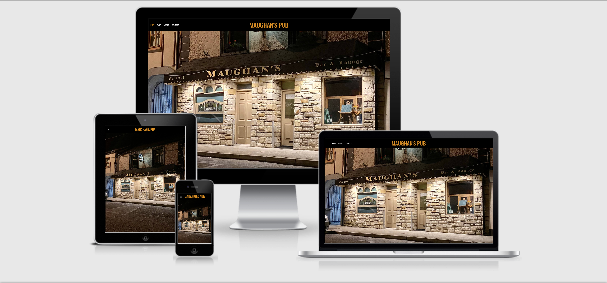
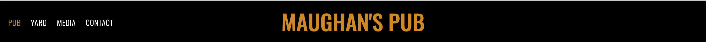
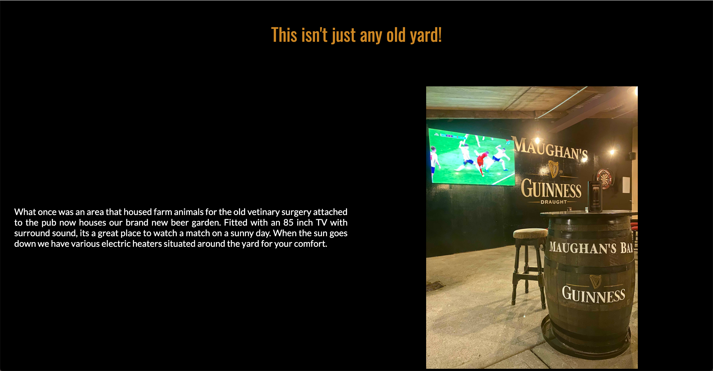
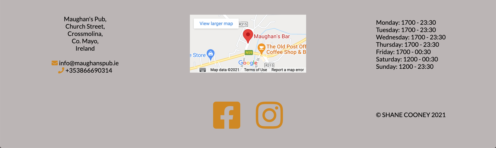
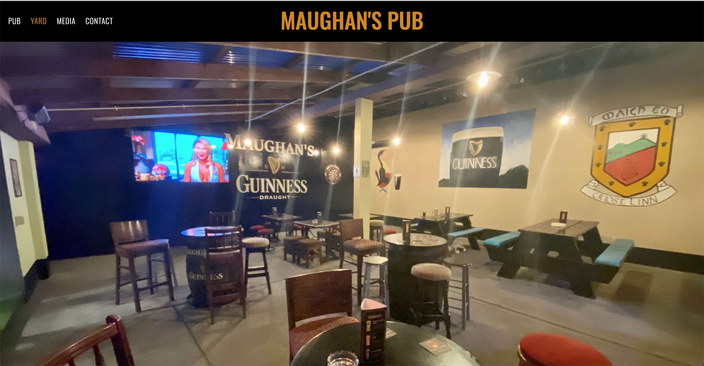

# Maughans Pub 
## Introduction
Maughans Pub is a website about Maughans Pub, a traditional Irish Pub in Crossmolina, Co. Mayo in the west of Ireland. The website is targetted towards both potential customers and current customers of the pub. As there is no current website, it will be a useful asset for customers with common questions such as hosting events, opening hours and the location of the pub.

### User Stories
* As a user I want to find the opening hours for Maughans Pub. 
* As a user I want to easily find information about what facilities Maughans Pub has.
* As a user I want to easily find out about the location of Maughans Pub. 
* As a user I want to know if Maughans Pub is suitable for events.
* As a user I want to easily contact someone about hosting an event at the pub. 
* As the business we want to promote the pub and its facilities.
* As the business we want to visually show our venue inluding our new yard. 
* As the business we want to drive traffic to our social media channels where we can promote upcoming events such as live music. 
* As the business we want a host a facility where potential and current customers can ask questions. 
* As the business we want to handle drink orders from the yard online.

### Opportunities
Arising from user stories 
|Opportunities | Importance | Viability / Feasibility
|-----|:------:|:-----:|
|**Promote the pub and its facilities** | 5 | 5 |
|**Provide useful information such as location and opening hours** | 5 | 5 |
|**Provide information on events at Maughans Pub** | 5 | 5 |
|**Provide links to social media channels to drive traffic** | 5 | 5 |
|**Provide contact form for further queries** | 5 | 5 |
|**Responsive site suitable for mobile and tablets**| 5 | 5 |
|~~Enable users to order drinks from the yard online~~ | 3 | 1 |

## Wireframe mockups
I utilised Balsamiq to produce wireframes to organise the site structure and content placement. I used the templates provided for iPad and iPhone to create a visually pleasing mobile responsive design.

* [Home page wireframe](https://github.com/shanecooney111/maughans_pub/blob/master/assets/wireframes/index.png)
* [Yard page wireframe](https://github.com/shanecooney111/maughans_pub/blob/master/assets/wireframes/Yard.png)
* [Media page wireframe](https://github.com/shanecooney111/maughans_pub/blob/master/assets/wireframes/Media.png)
* [Contact page wireframe](https://github.com/shanecooney111/maughans_pub/blob/master/assets/wireframes/Contact%20Page.png)

## Features
 
### Common Features 
* Navigation Bar
  * The navigation bar features a common design across all 5 of the .html pages and features a text logo Maughans Bar in the centre with 4 links to the left.  
  * The navigation bar includes links on the logo, Pub, Yard, Media and Contact. The various title links head to their respective pages for easy navigation. When the text logo is clicked it links back to the index.html page. 
  * The navigation bar is fully responsive and with the use of a media query, the format changes to a burger menu on the left hand side which the user can toggle on devices smaller than 1025px to display the 4 navigation links. 
  * The current page is displayed in a different colour as the other links as a visual indicator to the user as to which page they are currently on. A line appearing underneath the text on hover to visually indicate to users that they are clickable.

* Information Grids

  * On both the Pub and Yard pages there are 5 common information grids which all use a common layout.
  * They are build using CSS Grid in a mobile first design and use a Media Query to transform the layout for screens larger than 1024px. 
  * Each of the 5 sections contain a Heading, Text providing various pieces of information on the business and an image. 
  * The background colours and font colours were chosen to match the colours that the outside of the Pub are styled in and to provide maximum contrast to the user.

  

* Footer 

  * The Footer is common to all 5 html pages built intp the Maughans Pub website.
  * The Footer was made using CSS Grid in a mobile first design. It uses two media queries to expand for both tablet and laptop devices to make it look more estically pleasing.
  * The Footer contains 5 different sections with each providing useful information to the user. They are Contact Details, Map, Opening Hours, Social Media Links and finally the Web Designer.
  * The background colour was chosen to provide contrast to visually impaired users and to clearly define the Footer area from different sections on the pages.

  

### Home Page Features

* Hero image

  * The Pub page displays a hero image giving a clear visual indication of the business from the outside.
  * This image acts as a second Logo providing additional information from the sign such as Est. 1911.

### Yard Page Features

* Hero Image
  
  * The Yard page displays a hero image giving the user a clear overview of the yard.
  * The image was taken in Pano mode in an attempt to fit in as much of the yard as possible.

* Gallery Section
  
  * I created a Gallery section on the Yard page to display multiple photos.
  * The Gallery section is fully responsive using CSS Grid and Media Querys to change format depending on what device the user is using.
  * As the Yard area of the business is new, I wanted to display as much of this new area to the user as possible. 
  * On a tablet device, one extra image displays to ensure the grid looked symettrical in a 3X3 format. This image doesn't appear on a mobile or desktop device.

* Events Section
  
  *

### Media Page Features

* Hero Video

  * 

* Instagram Feed

  * 

* Covid Video

  * 

### Contact Page Features

* Contact Form

  * 

### Hidden Page Features

* Contact Form Submission

  * 

## Future Enhancements

* 
* 

## Testing

* Interesting Bugs

## Validator Testing 

## Deployment 
 
* The site was deployed to GitHub pages. the steps to deploy are as follows: 
  * In the GitHub repository, navigate to the settings tab
  * Select the pages link from the setting menu on the left hand side 
  * Under the GitHub Pages from the source section drop-down menu, select the master branch 
  * One the master branch has been selected, the page will be automatically refreshed with a detailed ribbon display to indicate the successful deployment. 
  
The live link can be found here - [Maughans Pub Live Site](https://shanecooney111.github.io/maughans_pub/)

## Credits

### Content  
* The text for all other pages was created by myself. 
* The reference material on HTML and CSS provided by [w3schools.com](https://www.w3schools.com/) was utilised to implement flexbox and grid and as general reference material for other areas. 
* The icons used for the logo, bookmark link, download button and in the footer were taken from [Font Awesome](https://fontawesome.com/)

### Media 
